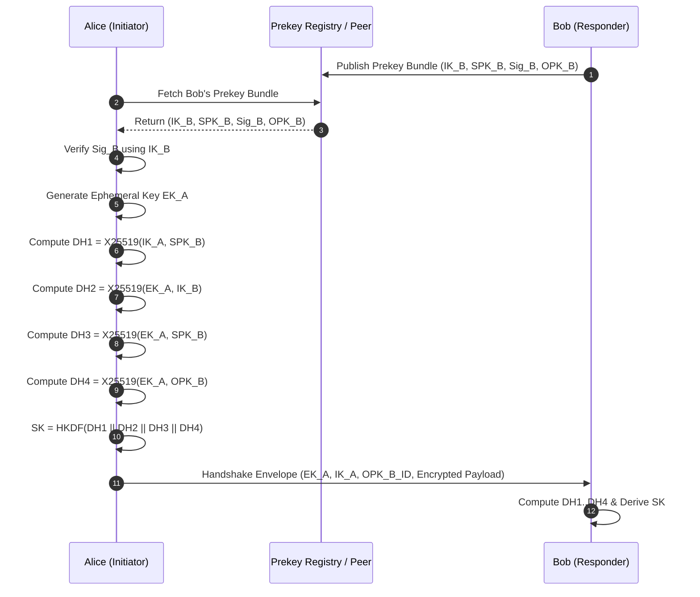
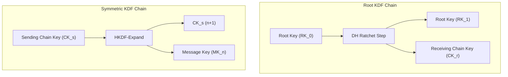

# Kamui Protocol Specification (v2.0.0-draft)

Protocol-First Architecture for End-to-End Encrypted Peer-to-Peer Messaging

---

## Abstract

Kamui v2 introduces a zero-trust, metadata-minimizing **Protocol-First Architecture** designed for high-assurance peer-to-peer messaging over anonymous overlay networks (specifically I2P SAM). This specification defines the cryptographic foundations, key agreement mechanisms, message ratcheting state machine, encapsulated envelope wire format, and OS notification boundary isolation guarantees.

---

## 1. Identity & Cryptographic Primitives

Kamui v2 relies on modern, misuse-resistant cryptographic primitives:

| Cryptographic Primitive | Implementation / Curve | Security Target |
| :--- | :--- | :--- |
| **Long-Term Identity Key (`IK`)** | Ed25519 (Signing) / X25519 (DH) | Peer Authentication & Identity |
| **Signed Prekey (`SPK`)** | X25519 | Asynchronous Authentication |
| **One-Time Prekey (`OPK`)** | X25519 | Forward Secrecy during Handshake |
| **Ephemeral Key (`EK`)** | X25519 | Per-Session / Per-Ratchet DH |
| **Symmetric Encryption** | AES-256-GCM / ChaCha20-Poly1305 | Authenticated Encryption with Associated Data (AEAD) |
| **Key Derivation Function (KDF)** | HKDF-SHA256 (RFC 5869) | State progression & key extraction |

### 1.1 Long-Term Identity Keys (`IK`)

- Each Kamui node maintains an Ed25519 long-term identity keypair `(IK_priv, IK_pub)`.
- For Diffie-Hellman operations, `IK_pub` is converted to Curve25519 (`IK_dh_pub`) via birational equivalence:
  $$\text{Curve25519}_u = \frac{1 + \text{Ed25519}_y}{1 - \text{Ed25519}_y}$$

### 1.2 Prekey Infrastructure

To enable asynchronous messaging (when the recipient is offline), nodes publish a **Prekey Bundle** containing:

- `IK_pub`: Identity public key.
- `SPK_pub`: Medium-term signed prekey.
- `SPK_sig`: Signature $\text{Ed25519Sign}(IK\_priv, SPK\_pub)$.
- `OPK_pub_i`: A pool of one-time prekeys $i \in \{1 \dots n\}$.

---

## 2. Key Agreement Flow (X3DH / Noise Protocol)

Initial session establishment utilizes the **Extended Triple Diffie-Hellman (X3DH)** protocol or **Noise_IK** pattern.



### 2.1 Diffie-Hellman Combinations

1. $DH_1 = \text{X25519}(IK_{A\_dh}, SPK_{B})$ *(Mutual Authentication)*
2. $DH_2 = \text{X25519}(EK_{A}, IK_{B\_dh})$ *(Initiator Forward Secrecy)*
3. $DH_3 = \text{X25519}(EK_{A}, SPK_{B})$ *(Responder Forward Secrecy)*
4. $DH_4 = \text{X25519}(EK_{A}, OPK_{B})$ *(One-Time Prekey Forward Secrecy, omitted if pool exhausted)*

### 2.2 Shared Key Derivation

$$\text{SK} = \text{HKDF-Extract}(\text{Salt}=0^{32}, \text{Info}=\text{"Kamui-v2-X3DH"}, DH_1 \parallel DH_2 \parallel DH_3 \parallel DH_4)$$

---

## 3. Ratchet Engine (Double Ratchet System)

Once session key $\text{SK}$ is established, Kamui initializes a **Double Ratchet** state machine providing **Break-in Recovery (Post-Compromise Security)** and **Forward Secrecy**.



### 3.1 KDF Chain Progression

The state consists of:

- **Root Key (`RK`)**: Updated during DH ratchet steps.
- **Sending Chain Key (`CK_s`)**: Advanced for each sent message.
- **Receiving Chain Key (`CK_r`)**: Advanced for each received message.

#### Symmetric-Key Ratchet (Per Message)

$$\begin{aligned}
MK_{i} &= \text{HKDF-Expand}(CK_i, \text{"Kamui-MsgKey"}, 32) \\
CK_{i+1} &= \text{HKDF-Expand}(CK_i, \text{"Kamui-NextChain"}, 32)
\end{aligned}$$

#### DH Ratchet Step (Per Turn Exchange):
$$\begin{aligned}
DH_{out} &= \text{X25519}(DH_{our\_priv}, DH_{their\_new\_pub}) \\
(RK_{n+1}, CK_r) &= \text{HKDF-Extract-and-Expand}(RK_n, DH_{out}, \text{"Kamui-DHRatchet"})
\end{aligned}$$

### 3.2 Skipped Message Keys & Out-of-Order Delivery
- If message sequence number $N > N_{expected}$, intermediate message keys $MK_{skipped}$ are computed and cached in a secure table.
- **Security Constraint**: Skipped keys are bound by:
  - Max capacity per conversation: $1000$ keys.
  - Time-To-Live (TTL): $7$ days, after which unconsumed skipped keys are zeroized.

---

## 4. Encapsulated Message Envelope Architecture

All transport messages over I2P SAM are wrapped in an encapsulated binary envelope to prevent payload header inspection.

### 4.1 Encapsulated Wire Schema

```
+-------------------+-------------------+-----------------------------------+
| Field             | Size              | Description                       |
+-------------------+-------------------+-----------------------------------+
| Version           | 1 byte            | Protocol Version (0x02)           |
| Flags             | 1 byte            | Bitfield (Handshake, Ack, Prekey) |
| Sender Fingerprint| 32 bytes          | SHA-256(IK_A_pub)                 |
| Ephemeral DH Key  | 32 bytes          | Current Ratchet X25519 Public Key |
| Sequence (N)      | 4 bytes (uint32)  | Counter in current chain          |
| Prev Chain (PN)   | 4 bytes (uint32)  | Length of previous chain          |
| IV                | 12 bytes          | GCM Nonce                         |
| AEAD Ciphertext   | Variable          | Encrypted JSON/CBOR Payload       |
| Auth Tag (MAC)    | 16 bytes          | AEAD Tag (AES-GCM / Poly1305)     |
+-------------------+-------------------+-----------------------------------+
```

### 4.2 Decrypted Payload JSON Schema

```json
{
  "v": 2,
  "msg_id": "msg_1723465190000",
  "conv_id": "conv_c_1723465190000",
  "timestamp": 1723465190000,
  "content": "Encrypted text payload",
  "attachments": [],
  "sig": "Base64(Ed25519Sign(IK_A, SHA256(content + timestamp)))"
}
```

---

## 5. OS Boundary & Notification Metadata Leak Prevention

To protect privacy against lockscreen shoulder-surfing, OS notifications, and system log inspectors:

1. **Zero Plaintext Transmission**: Decrypted plaintext (`decryptedText`) MUST NOT be passed outside the application process sandbox.
2. **Generic System Notifications**:
   - Title: `Encrypted Message Received`
   - Body: `New Secure Payload`
3. **No Sender Identity Leak**: Contact names, destination hashes, and note content are strictly masked at the OS notification payload layer.

### 5.1 Duress Panic Mode (Defense-in-Depth)

When a **Duress PIN** is entered, Kamui performs a **defense-in-depth local storage & key wipe**:
- All SQLite message and contact databases are deleted from disk.
- All keys in `flutter_secure_storage` (platform Keychain/Keystore) are erased.
- The UI transitions to a disguised decoy feed with no trace of the Kamui session.

> **Accuracy Note**: The Duress mechanism is a **defense-in-depth local wipe** — it does not guarantee forensic-unrecoverability at the hardware or OS level (e.g., against NAND flash wear-leveling or advanced chip-off forensics). Claims of "forensic-proof destruction" are not made. The wipe is meaningful protection against casual device access, law-enforcement logical extractions, and opportunistic adversaries.

---

## 6. Inbound Transport (SAM v3.3 Wire Termination)

Outbound delivery uses per-message sockets (`HELLO` → `STREAM CONNECT` → write → destroy). Inbound reception is a persistent listener armed immediately after `SESSION CREATE` succeeds, implemented in `lib/services/sam_service.dart` and exercised by `test/sam_inbound_test.dart`.

### 6.1 Mode Selection

| Mode | Constant | Mechanism |
| :--- | :--- | :--- |
| **FORWARD** (primary) | `SamInboundMode.forward` (`KamuiConstants.samInboundMode`) | Kamui binds a local `ServerSocket` on `127.0.0.1:7657` and hands the port to the router via `STREAM FORWARD`. Each inbound I2P connection is delivered as a loopback TCP connection. |
| **ACCEPT** (fallback) | `SamInboundMode.accept` | For routers without FORWARD support: repeated `STREAM ACCEPT ID=<session> SILENT=false` on dedicated sockets; each accepted socket serves exactly one connection, then a fresh socket is armed. |

### 6.2 FORWARD Handshake Sequence

```
Kamui → SAM : STREAM FORWARD ID=<session> PORT=7657 HOST=127.0.0.1 SILENT=false
SAM  → Kamui: DIRECTION RESULT=OK        (or STREAM STATUS RESULT=OK)
Router      : opens loopback TCP connection to 127.0.0.1:7657 per inbound peer
```

### 6.3 FROM-Line Framing (SILENT=false)

With `SILENT=false`, the first line of every inbound connection is the sender announcement:

```
FROM <base64 I2P destination>\n<encrypted payload line>\n
```

Rules (fail-closed):

1. **Sender identity comes ONLY from the `FROM` line** — it is never inferred or guessed from ciphertext.
2. The first line MUST match `FROM <destination>` where `<destination>` is non-empty base64-variant text (`[A-Za-z0-9+~/=-]+`). Any other first line ⇒ the connection is dropped and logged; no crash.
3. Payload framing is newline-delimited: each subsequent non-empty line is one encrypted payload dispatched to `handleIncomingPayload(senderDestination, payload)`. v4 wire frames are base64 segments and JSON envelopes contain no raw newlines, so this is unambiguous.
4. Partial TCP reads are handled by a per-connection line-buffer accumulator; a final payload missing its trailing `\n` is flushed tolerantly when the peer closes.
5. A connection closed before any `FROM` line is dropped and logged.

### 6.4 ACCEPT Fallback Loop

Each iteration: open dedicated socket → `HELLO VERSION` → `STREAM ACCEPT ID=<session> SILENT=false` → await `STREAM STATUS RESULT=OK` → serve exactly one connection (same FROM-line contract as §6.3) → destroy socket → re-arm. Failures pause 500 ms before re-arming.

### 6.5 Reconnect Policy

On unexpected control-socket loss (error or remote close) while a session was live:

- Status `reconnecting` is emitted on `statusStream`.
- Retry loop: `HELLO` → `SESSION CREATE` → listener re-arm, with exponential backoff **2 s → 4 s → … → 60 s cap**, each delay jittered **±20%**.
- The loop never gives up while the service is alive; `dispose()` cancels it permanently.

---

## 7. Conformance & Verification Matrix

| Requirement | Implementation Component | Status | Verification Criteria |
| :--- | :--- | :---: | :--- |
| **Metadata Protection** | `NotificationService` & `providers.dart` | ✅ Implemented | Zero plain/sender data in `show()` |
| **Static Code Integrity** | `flutter analyze` | ✅ Implemented | `No issues found!` |
| **Fail-Closed Encryption** | `SessionManager.encryptV4()` & `encryptMessage()` | ✅ Implemented (Live) | Throws `SessionUnavailableException`; no silent downgrade |
| **Full X3DH Key Agreement** | `X3dhService` & `SessionManager` | ✅ Implemented (Live) | Authenticated 3-DH / 4-DH with Ed25519 SPK verification |
| **Double Ratchet Engine** | `DoubleRatchetSession` & `SessionManager` | ✅ Implemented (Live) | DH ratchet + symmetric KDF + candidate state rollback |
| **Skipped Key Store (Anti-DoS)** | `SkippedKeyStore` | ✅ Implemented (Live) | Peek ➔ Authenticate ➔ Consume pattern with max skip bound |
| **Prekey Bundle QR Handshake** | `IdentityKeyService` & `QrShareDialog` | ✅ Implemented (Live) | Embeds full v3 PreKeyBundle in QR payload |
| **Inbound Transport (FORWARD)** | `SamService._armForwardListener` & `_InboundConnectionHandler` | ✅ Implemented (Live) | FROM-line sender routing, newline framing, invalid-FROM drop; `test/sam_inbound_test.dart` |
| **Inbound Transport (ACCEPT fallback)** | `SamService._runAcceptLoop` | ✅ Implemented (Live) | One connection per armed socket, re-arm loop passes same inbound suite |
| **Reconnect Backoff** | `SamService._runReconnectLoop` | ✅ Implemented (Live) | 2s→60s cap ×2, ±20% jitter, fake-async verified retry sequence |
| **Duress Wipe (Defense-in-Depth)** | DB + `flutter_secure_storage` erase | ✅ Implemented | Local storage & key wipe on duress PIN |
